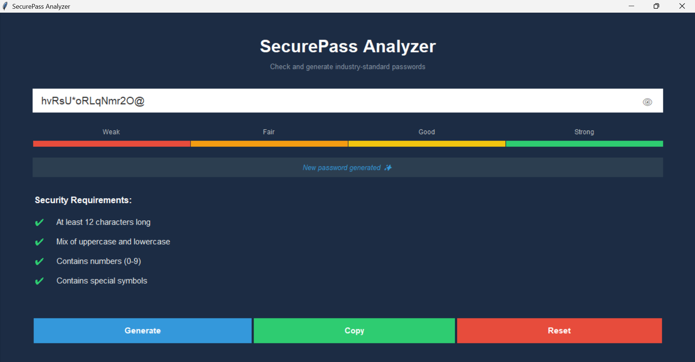

# SecurePass Analyzer 🔐

SecurePass is a professional password strength analyzer built with **Python** and **Tkinter**.  
It provides real-time password analysis, visual strength indicators, and secure password generation.

## Features
- Real-time password strength analysis
- Visual strength bar (Weak → Strong)
- Security requirements checklist
- Strong password generator
- Copy password to clipboard
- Clean and modern Tkinter UI

## Technologies
- Python 3
- Tkinter
- Regular Expressions (re)

## Screenshot

python PasswordStrengthChecker.py

